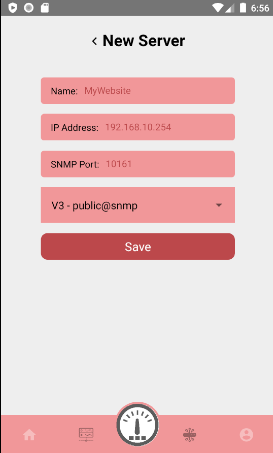

<h1 align="center"> NamedZeus Mobile </h1>

> A simple server network monitoring app by SNMP mibs.

<p align="center">
    
</p>

- Also, you can write by opening an Issue and also solve a current issue if possible.
- Fork this project to your Github account.
- This software is created under [MIT License](https://github.com/MuriloChianfa/NamedZeus-Mobile/blob/main/LICENSE)

<hr>

## Dependencies versions

- Docker 20.10.12
- Docker-compose 2.2.3
- NodeJS 14.21.3
- Java SDK 15.0.2
- Android 8.0 API 26

---

## Running the project

1. Run the API environment
```bash
docker compose up -d
```

2. Run the android application
```bash
npx react-native run-android
```

## Application screenshots:

- [Sign UP](#sign-up)
- [Sign In](#sign-in)
- [Profile](#profile)
- [SNMP New](#snmp-New)
- [SNMP List](#snmp-List)
- [Server New](#server-new)
- [Server List](#server-list)
- [Dashboard](#dashboard)

### Sign UP


### Sign In


### Profile


### SNMP New


### SNMP List


### Server New


### Server List


### Dashboard


